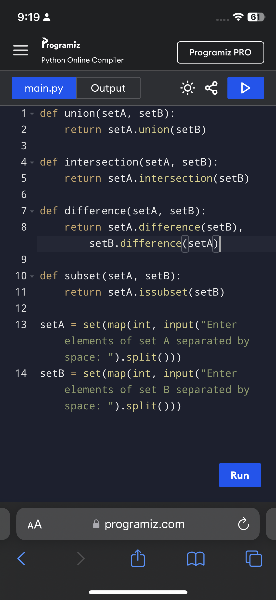

# Set Theory Program

## Description:
This program demonstrates the basic concepts of set theory including:
- Union (A ∪ B)
- Intersection (A ∩ B)
- Difference (A − B and B − A)
- Subset check (A ⊆ B)

## Instructions:
1. Run the program.
2. Enter two sets (A and B) as space-separated numbers.
3. The program will display the results for the operations: union, intersection, difference, and subset.

## Example:
**Input:**
Enter elements of set A separated by space: 1 2 3 4
Enter elements of set B separated by space: 3 4 5 6

**Output:**
A ∪ B = {1, 2, 3, 4, 5, 6}
A ∩ B = {3, 4}
A − B = {1, 2}
B − A = {5, 6}
A ⊆ B: False

## Screenshots:
  
  

